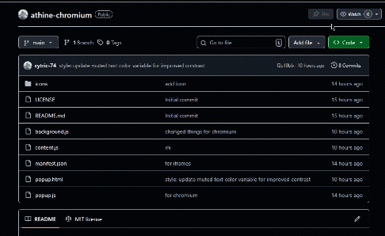

<div align="center">

<br />

<br />

# athine

**Independent volume control for every Chromium tab.**

</div>

---

## Overview

For controling the audio volume of each browser tab independently.
For firefox user 

*no datas are collected*

## Installation

### From source

```bash
git clone https://github.com/cytric-74/athine.git
cd athine
```
or you can download the folder - 


1. Open Chrome and navigate to `chrome://extensions`
2. Enable **Developer mode** (top right toggle)
3. Click **Load unpacked**
4. Select the `athine-chromium` folder

The extension icon will appear in your toolbar.

---

## Compatibility

Athine targets **Manifest V3** and works on all Chromium-based browsers.

| Browser | Support |
|---|---|
| Google Chrome | ✓ |
| Microsoft Edge | ✓ |
| Opera | ✓ |
| Brave | ✓ |
| Vivaldi | ✓ |
| Firefox | [here](https://github.com/cytric-74/athine) |


<div align="center">
<sub>built by <a href="https://github.com/cytric-74">cytric-74</a></sub>
</div>
